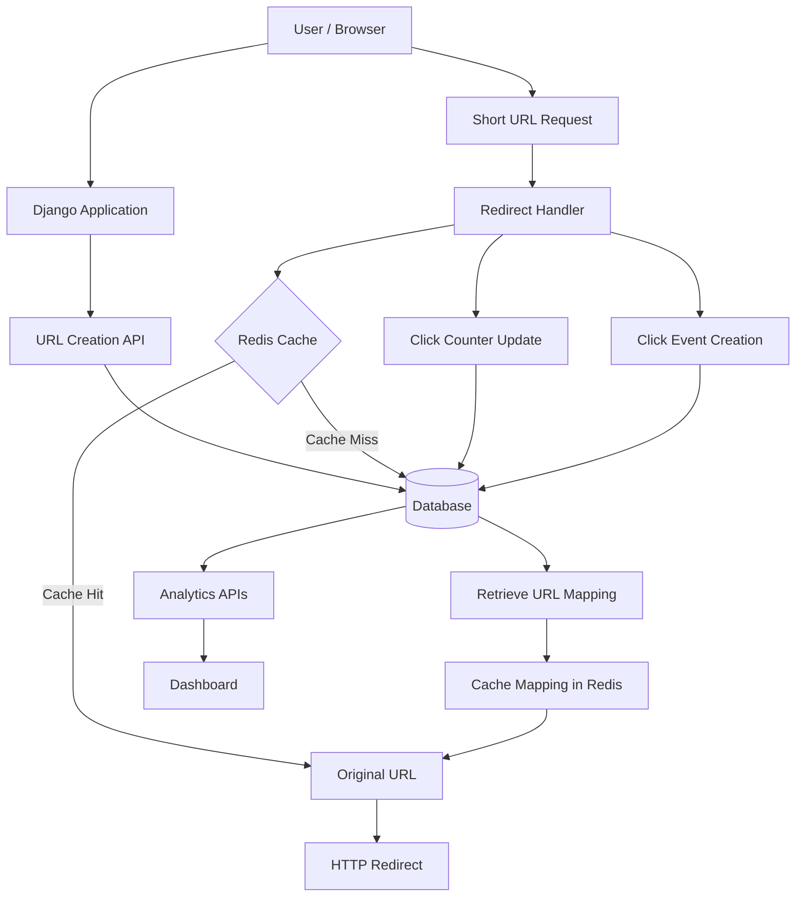
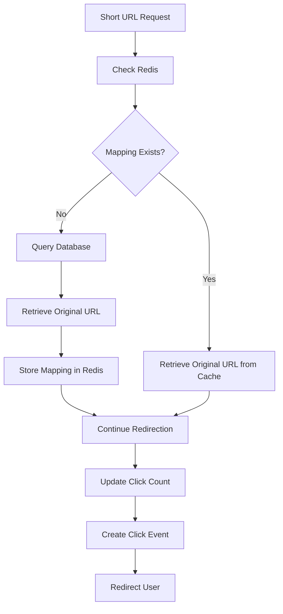

# 🔗 Linkly — A URL Shortener Built During My Learning Sprint

**Learning Sprint | Learning by Building | Python · Django · REST APIs · Redis · SQL**

Linkly is a URL shortening and analytics application I'm building as part of a personal learning sprint to explore backend development and high-level system design through hands-on implementation. Instead of only learning about databases, caching, and APIs individually, I wanted to build a small product that brings these concepts together in one working application.

The project allows a user to convert a long URL into a shorter, shareable link, redirect visitors to the original destination, and track how the link is used. Along the way, I'm using Linkly to strengthen my understanding of **Django, REST APIs, Redis caching, database operations, event tracking, API design, and backend system architecture**.

## 🎯 Why I'm Building This

This sprint is about learning by implementing, debugging, and understanding how a system works—not just getting an application to run.

With Linkly, I'm exploring questions such as:

- How does a URL shortener generate and store unique short codes?
- What happens when a user opens a shortened URL?
- How can Redis reduce repeated database lookups?
- What is the difference between caching a URL mapping and storing it permanently in a database?
- How can a database safely update a click counter when multiple requests arrive?
- How should click events be stored to support analytics over time?
- How can a backend expose URL creation and analytics through REST APIs?
- If the application grows, how could caching, rate limiting, and database design help it scale?

The goal is to build a working application while gradually moving from individual backend features toward understanding the **request flow, data flow, and high-level design (HLD)** behind a real-world service.

## ✨ Current Features

- 🔗 **URL shortening** — convert long URLs into compact, unique short links.
- ↪️ **URL redirection** — redirect visitors from a short code to the original destination.
- ⚡ **Redis caching** — cache URL mappings to reduce repeated database lookups.
- 📊 **Click tracking** — maintain total click counts and record individual click events with timestamps.
- 📈 **Analytics dashboard** — view total URLs, total clicks, the most-clicked link, and daily click activity.
- 🌐 **REST APIs** — create URLs, retrieve stored links, and access analytics through Django REST Framework.
- 📋 **Link management** — view shortened URLs and their click counts in a dashboard.
- 📋 **Copy link** — copy generated short URLs directly from the interface.
- ⚠️ **Error handling** — handle invalid short codes and provide feedback for failed operations.

## 🧰 Tech Stack

| **Technology** | **How it is used** |
|---|---|
| Python | Backend programming language |
| Django | Web framework and request handling |
| Django REST Framework | Building RESTful APIs |
| SQLite | Persistent storage for URLs and click events |
| Redis | Caching frequently accessed URL mappings |
| django-redis | Integrating Redis with Django's cache framework |
| HTML | Dashboard structure |
| CSS | Dashboard styling and responsive layout |
| JavaScript | Frontend interactions and API requests |
| Chart.js | Visualizing click activity |
| Docker | Running Redis locally |
| Git & GitHub | Version control and project hosting |

## 🏗️ System Architecture

Linkly uses Django to handle URL creation, redirection, and analytics. Redis acts as a cache for frequently accessed URL mappings, while the relational database stores the original URLs and click events.

### At a glance



### Main components

- **Django Application:** Handles incoming HTTP requests, URL creation, redirection, and analytics.
- **URL Service:** Generates short codes and stores URL mappings.
- **Redis Cache:** Stores frequently accessed short-code-to-original-URL mappings.
- **Relational Database:** Stores URL records, click counts, and individual click events.
- **Analytics APIs:** Retrieve and aggregate stored information for the dashboard.
- **Frontend Dashboard:** Displays URL information, statistics, and click activity.

## 🔁 URL Shortening and Redirection Flow

### When a user creates a short URL

1. The user enters a long URL into the dashboard.
2. The frontend submits the URL to the Django backend.
3. Django validates the input and generates a unique short code.
4. The original URL and short code are stored in the database.
5. The backend returns the shortened URL in its response.
6. The dashboard displays the generated short link, which the user can copy and share.

### When a user opens a shortened URL

1. A visitor opens a short URL, such as `http://127.0.0.1:8000/abc123/`.
2. Django receives the request and extracts the short code.
3. The redirect handler checks Redis for the corresponding original URL.
4. If the mapping exists in Redis, it is retrieved directly from the cache.
5. If the mapping is not cached, Django retrieves it from the database and stores it in Redis.
6. Django increments the URL's click counter and creates an individual click event.
7. The visitor is redirected to the original URL.

> **Important:** Redis is used as a cache, not as the permanent source of URL data. The database retains the URL mapping and click information, while Redis helps avoid repeated database lookups for cached mappings.

## ⚡ Understanding Redis Caching

### Why use Redis?

Without caching, every short URL request would need to query the database to retrieve the original URL. As the number of redirections increases, repeated database lookups can add unnecessary load.

Redis stores frequently accessed URL mappings in memory, allowing the application to retrieve them without querying the database on every cache hit.

### Cache lookup flow



### How Linkly uses Redis

The application uses Django's cache framework with `django-redis`.

A cache key is generated for each short code:

```python
cache_key = f"shorturl:{code}"
```

The application first attempts to retrieve the original URL:

```python
original_url = cache.get(cache_key)
```

If the key is missing, Django retrieves the URL from the database and stores the mapping in Redis:

```python
if original_url is None:
    url = get_object_or_404(ShortURL, short_code=code)
    original_url = url.original_url
    cache.set(cache_key, original_url, timeout=3600)
```

The cached mapping has a time-to-live (TTL) of 3600 seconds, or one hour.

**Key concept:** Caching improves retrieval efficiency, but cached values may expire. When a cache entry expires, the application can fetch the mapping from the database again.

## 🗄️ Database Design

Linkly uses a relational database to store URL information and individual click events.

### 1. ShortURL Model

The `ShortURL` model stores the original URL, its unique short code, total clicks, and creation timestamp.

| **Field** | **Purpose** |
|---|---|
| `id` | Unique database identifier |
| `original_url` | Original destination URL |
| `short_code` | Unique code used in the shortened URL |
| `clicks` | Aggregate number of clicks |
| `created_at` | Timestamp when the URL was created |

### 2. URLClick Model

The `URLClick` model stores individual click events associated with a shortened URL.

| **Field** | **Purpose** |
|---|---|
| `id` | Unique click event identifier |
| `short_url` | Foreign key referencing the associated `ShortURL` |
| `clicked_at` | Timestamp of the click event |

Each shortened URL can have multiple click events, creating a one-to-many relationship between `ShortURL` and `URLClick`.

### Why store both a click counter and individual events?

The `clicks` field provides a convenient aggregate count without needing to count every event each time the dashboard loads.

The `URLClick` table preserves individual timestamps, which makes it possible to group events by date and display click activity over time.

## 📊 Analytics and Dashboard

The dashboard provides an overview of shortened URLs and their performance.

### Overall analytics

- **Total URLs:** Number of shortened URL records stored in the database.
- **Total Clicks:** Sum of the click counters across all URLs.
- **Most-Clicked URL:** The shortened URL with the highest recorded click count.
- **Click Activity:** Daily click totals over the last seven days.

### URL-specific analytics

For a particular short code, the analytics API returns:

- The short code
- The original URL
- Total recorded clicks
- Individual click timestamps

### Click activity aggregation

The click activity endpoint filters click events to the last seven days, groups them by date, and counts the events for each date.

This allows the frontend to visualize click trends using Chart.js.

> **Note:** The activity endpoint groups dates with recorded events. The dashboard can fill missing dates with zero when preparing the chart.

## 🌐 REST API Design

Django REST Framework is used to expose endpoints for URL creation, URL retrieval, and analytics.

| **Method** | **Endpoint** | **Purpose** |
|---|---|---|
| `POST` | `/api/shorten/` | Create a shortened URL |
| `GET` | `/api/urls/` | Retrieve all shortened URLs |
| `GET` | `/api/analytics/summary/` | Retrieve overall analytics |
| `GET` | `/api/analytics/activity/` | Retrieve daily click activity |
| `GET` | `/api/analytics/<code>/` | Retrieve analytics for a specific URL |
| `GET` | `/<code>/` | Redirect to the original URL |

### 1. URL Shortening API

**Endpoint**

```http
POST /api/shorten/
Content-Type: application/json
```

**Example request**

```json
{
  "original_url": "https://www.example.com/articles/system-design"
}
```

**Example response**

```json
{
  "id": 1,
  "original_url": "https://www.example.com/articles/system-design",
  "short_code": "abc123",
  "short_url": "http://127.0.0.1:8000/abc123/",
  "clicks": 0
}
```

The backend validates and serializes the submitted URL, creates a database record, and returns the generated short link.

### 2. Retrieve All URLs

**Endpoint**

```http
GET /api/urls/
```

Returns the shortened URLs stored in the database, including their original URLs, short codes, click counts, and creation timestamps.

### 3. Analytics Summary API

**Endpoint**

```http
GET /api/analytics/summary/
```

Returns a summary containing the total number of URLs, total clicks, and the most-clicked URL.

### 4. Click Activity API

**Endpoint**

```http
GET /api/analytics/activity/
```

Returns daily click counts grouped by date for the last seven days.

### 5. URL-Specific Analytics API

**Endpoint**

```http
GET /api/analytics/abc123/
```

Returns analytics for the specified short code, including total clicks and the timestamps of individual click events.

## 🧠 Backend Concepts I'm Learning Through Linkly

Although Linkly is a relatively small application, it brings together several important backend concepts.

### 1. REST API Design

REST APIs provide a structured way for the frontend to communicate with the backend. Django REST Framework handles serialization, request processing, and JSON responses.

### 2. Caching

Redis reduces repeated database lookups for frequently accessed URL mappings. This introduces cache hits, cache misses, TTLs, and the distinction between cached and persistent data.

### 3. Database Operations

Django's `F()` expressions allow the database to increment click counts directly, rather than relying on a value read earlier by the application.

For example:

```python
ShortURL.objects.filter(short_code=code).update(
    clicks=F("clicks") + 1
)
```

This helps avoid lost updates that can occur when multiple requests read and overwrite the same counter value.

### 4. Event Tracking

Instead of storing only the total number of clicks, the application records individual click events. This provides a foundation for time-based analytics and more detailed reporting.

### 5. Data Aggregation

Django ORM aggregation functions such as `Count()` and `Sum()`, together with date truncation, help calculate overall statistics and daily click activity directly from stored data.

### 6. Separation of Responsibilities

The application separates URL data, click events, API serialization, request handling, and frontend presentation. This makes it easier to maintain and extend individual parts of the application.

## 🛠️ Project Structure

```text
url-shortener-app/
│
├── config/
│   ├── __init__.py
│   ├── settings.py
│   ├── urls.py
│   ├── asgi.py
│   └── wsgi.py
│
├── shortener/
│   ├── migrations/
│   ├── templates/
│   │   └── shortener/
│   │       └── home.html
│   ├── __init__.py
│   ├── admin.py
│   ├── apps.py
│   ├── models.py
│   ├── serializers.py
│   ├── tests.py
│   ├── urls.py
│   └── views.py
│
├── .env.example
├── .gitignore
├── manage.py
├── requirements.txt
└── README.md
```

## 🚀 Running the Project Locally

This project is currently intended for local development and learning. It has not been deployed to a public server.

### Prerequisites

- Python 3.x
- Git
- Docker Desktop

### 1. Clone the Repository

```bash
git clone https://github.com/prathiksharao17/url-shortener-app.git
cd url-shortener-app
```

### 2. Create and Activate a Virtual Environment

**Windows PowerShell**

```powershell
python -m venv venv
.\venv\Scripts\Activate.ps1
```

### 3. Install Dependencies

```powershell
pip install -r requirements.txt
```

### 4. Configure Environment Variables

Create a local `.env` file using the provided example:

```powershell
Copy-Item .env.example .env
```

Fill in the required values in `.env`, including your development secret key and Redis URL. Ensure the project loads the `.env` file according to its configuration.

### 5. Start Redis with Docker

```powershell
docker run --name urlshortener-redis -p 6379:6379 -d redis
```

If the container already exists, start it with:

```powershell
docker start urlshortener-redis
```

### 6. Apply Migrations

```powershell
python manage.py migrate
```

### 7. Start the Development Server

```powershell
python manage.py runserver
```

Open the application at:

`http://127.0.0.1:8000/`

To make it accessible to other devices on the same local network, run:

```powershell
python manage.py runserver 0.0.0.0:8000
```

Then use your machine's private IP address and port `8000`, subject to firewall and network settings.


## 💡 Key Takeaways

- A URL shortener involves more than generating a compact identifier; it requires reliable storage and redirection.
- Redis can reduce repeated database lookups by caching frequently accessed URL mappings.
- A database should remain the persistent source of truth for URL records and click events.
- Aggregate counters and individual event records serve different analytical purposes.
- Database-side updates using `F()` expressions help make counter increments safer under concurrent requests.
- REST APIs make backend functionality accessible to different clients.
- Analytics can be derived from event data using database aggregation.
- A small application can provide a practical way to understand caching, data flow, and backend system design.

This is a learning project, and I'm documenting not only what I build but also the reasoning behind how each component works.

